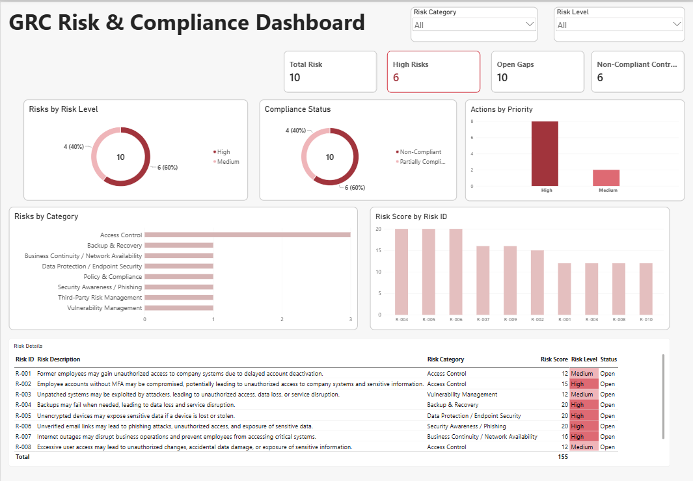

# GRC Risk & Compliance Dashboard

A fictional GRC assessment project developed using Microsoft Excel and Power BI to demonstrate risk assessment, control assessment, compliance analysis, gap identification, and action planning.

## Dashboard

## Project Objective

The objective of this project is to simulate a GRC assessment and transform identified risks, control weaknesses, compliance gaps, and recommended actions into an interactive Power BI dashboard.

## Tools Used

* Microsoft Excel
* Power BI

## Project Structure

* `GRC_Assessment.xlsx` — GRC assessment source data
* `GRC_Risk_Compliance_Dashboard.pbix` — Power BI dashboard
* `GRC Dashboard.png` — Dashboard preview

## Assessment Areas

* Risk Register
* Control Assessment
* Compliance Assessment
* Gap Register
* Action Plan

## Key Areas Analyzed

* Risk levels and categories
* High-risk items
* Control compliance status
* Compliance gaps
* Risk scores
* Action priorities

## Key Results

* 10 total risks
* 6 high risks
* 10 open gaps
* 6 non-compliant controls

## GRC Workflow

**Identify Risks → Assess Controls → Evaluate Compliance → Identify Gaps → Define Actions**

## Disclaimer

This is a fictional portfolio project created for educational and demonstration purposes. All organizations, risks, controls, evidence, and assessment results are hypothetical.
